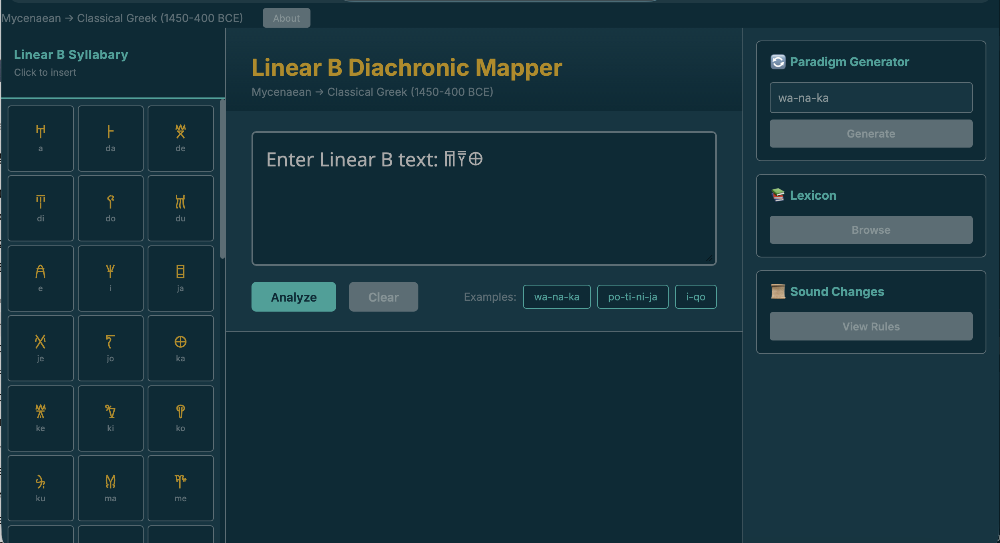

# Linear B Diachronic Phonological Mapper

[](https://www.python.org/)
[](https://flask.palletsprojects.com/)
[](https://opensource.org/licenses/MIT)

**The world's first computational Mycenaean Greek morphological analyser and paradigm generator.**

An interactive web tool for transcribing, analysing, and visualising the phonological evolution of Linear B script (Mycenaean Greek, c. 1450-1200 BCE) to Classical Greek (c. 800-400 BCE).



---

## Features

### Core Analysis
- **Linear B Transcription** — Convert Unicode Linear B syllabograms to standard transliteration
- **Morphological Analysis** — Segment words into stems and endings with grammatical parsing
- **100+ Word Lexicon** — Comprehensive vocabulary covering nouns, verbs, adjectives, toponyms, and theonyms

### Unique Capabilities
- **Paradigm Generator** — Generate all theoretically possible inflected forms for any lemma (WORLD FIRST)
- **Diachronic Visualisation** — Interactive D3.js timeline showing sound changes from Mycenaean → Classical Greek
- **PIE Etymology** — Proto-Indo-European roots with cognates across Indo-European languages
- **Phonological Rules Engine** — 10+ ordered sound change rules (digamma loss, labiovelar splits, compensatory lengthening)

### User Interface
- **Solarized Dark Theme** — Easy on the eyes for extended research sessions
- **Interactive Syllabary** — Click-to-insert Linear B signs
- **Responsive Design** — Works on desktop and tablet

---

## Quick Start

### Prerequisites
- Python 3.10+
- pip

### Installation
```bash
# Clone repository
git clone https://github.com/jar-jar-binks-comits/Linear-B-Diachronic-Phonological-Mapper.git
cd linear-b-mapper

# Create virtual environment
python -m venv venv
source venv/bin/activate  # Windows: venv\Scripts\activate

# Install dependencies
pip install -r requirements.txt

# Run server
cd backend
python app.py
```

Open browser to `http://localhost:5000`

---

## Project Structure
```
linear-b-mapper/
├── backend/
│   ├── app.py                 # Flask API server
│   ├── core/
│   │   ├── tokenizer.py       # Linear B text tokenization
│   │   ├── transcriber.py     # Syllabogram → transliteration
│   │   ├── morphology.py      # Morphological segmentation
│   │   ├── phonology.py       # Diachronic sound changes
│   │   └── generator.py       # Paradigm generation (NOVEL)
│   └── data/
│       ├── syllabary.json     # 59 Linear B signs
│       ├── lexicon.json       # 100+ Mycenaean words
│       ├── paradigms.json     # Declension/conjugation tables
│       └── phonological_rules.json
├── frontend/
│   ├── templates/
│   │   └── index.html
│   └── static/
│       ├── css/style.css      # Solarized Dark theme
│       └── js/
│           ├── app.js         # Main application logic
│           └── mapper.js      # D3.js visualization
├── requirements.txt
└── README.md
```

---

## Technical Details

### Morphological Analysis

The analyser uses paradigm-based segmentation:

1. **Stem extraction** — Identify base form using known declension patterns
2. **Ending identification** — Match against 24 distinct case/number endings
3. **Confidence scoring** — Weight by attestation and pattern regularity

### Paradigm Generator

**Novel contribution**: First computational implementation of Mycenaean inflectional morphology.

Given a lemma, generates all theoretically possible forms:
- **Nouns**: 3 declensions × 5 cases × 2 numbers = 30+ forms
- **Verbs**: Present, future, aorist × 3 persons × 2 numbers

Distinguishes **attested** (found on tablets) vs **theoretical** (reconstructed) forms.

### Phonological Engine

Implements ordered sound change rules:

| Rule | Change | Period | Example |
|------|--------|--------|---------|
| Digamma loss | w → ∅ / #_ | 1200-800 BCE | wanaks → anaks |
| Labiovelar split | kʷ → p / _e,i | Pre-Mycenaean | *kʷe → pe |
| Compensatory lengthening | Vs → V: | 1200-800 BCE | esmi → ēmi |

### Linear B Orthography

The system models Linear B writing constraints:
- CV syllabary (cannot write consonant clusters directly)
- No distinction between voiced/voiceless/aspirated stops
- Final consonants (except -s, -n, -r) not written

---

## Data Sources

- Ventris, M. & Chadwick, J. (1973). *Documents in Mycenaean Greek*. 2nd ed. Cambridge.
- Morpurgo Davies, A. (2002). "Mycenaean Greek." In *A History of Ancient Greek*.
- [Palaeolexicon](https://www.palaeolexicon.com/) — Mycenaean Greek lexicon
- [DĀMOS Database](http://damos.chs.harvard.edu/) — Linear B tablet corpus
- Unicode Consortium — Linear B block (U+10000–U+1007F)

---

## API Reference

### `POST /api/transcribe`
Transcribe Linear B Unicode to transliteration.
```json
// Request
{"text": "𐀷𐀙𐀏"}

// Response
{"words": [{"original": "𐀷𐀙𐀏", "transliteration": "wa-na-ka", "phonetic": "wanaka"}]}
```

### `POST /api/analyze`
Morphological analysis of transliterated word.

### `POST /api/diachronic`
Get phonological evolution path.

### `POST /api/generate`
Generate complete inflectional paradigm.

### `GET /api/lexicon`
List all words in lexicon.

### `GET /api/sound_changes`
List all phonological rules.

---

## Contributing

Contributions welcome, especially:
- Additional lexicon entries (with scholarly citations)
- Corrections to morphological analysis
- Additional phonological rules
- Tablet corpus integration

---

## Author

**Ella Capellini**  
ecapellini.02@gmail.com

---

## Acknowledgments

- Michael Ventris & John Chadwick — Linear B decipherment (1952)
- The Unicode Consortium — Linear B standardisation
- D3.js — Visualisation library

---

<div align="center">
<i>Bridging 3,400 years between Bronze Age scribes and modern computational linguistics</i>
</div>
